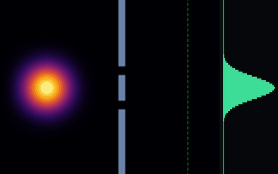
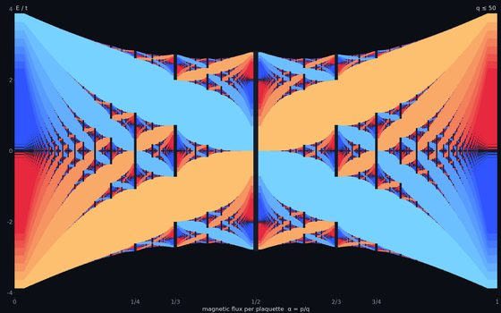
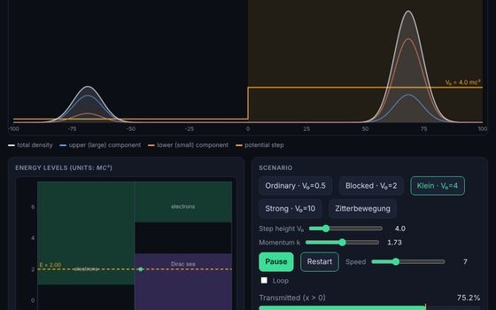
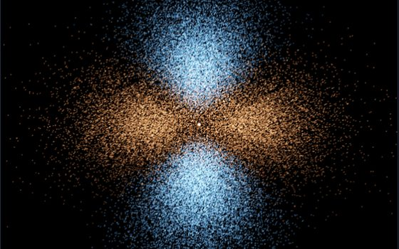
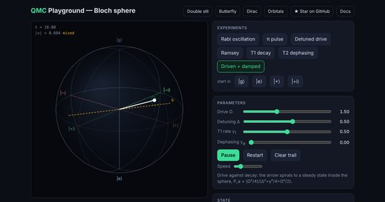
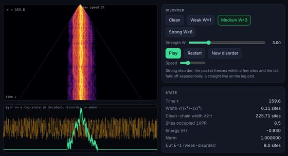
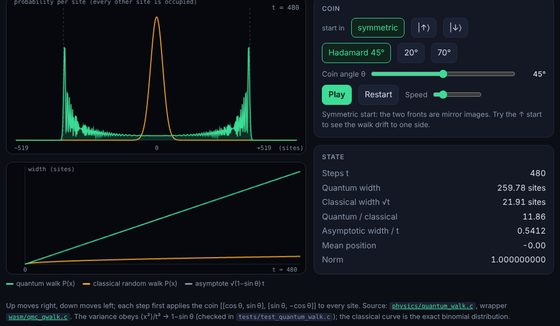
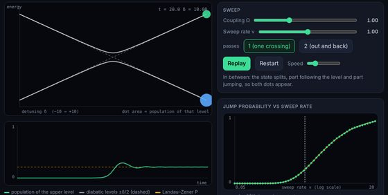

# QMC

Quantum mechanics simulation and visualization engine written in pure C.

<a class="primary" href="showcase.html">See the live demos</a>
<a href="setup/building.html">Build from source</a>
<a href="https://github.com/Harshit-Dhanwalkar/QMC">GitHub</a>

<a class="card" href="playground/index.html"><b>Double slit</b><small>2D Schrödinger solver, draw your own walls</small></a>
<a class="card" href="playground/butterfly.html"><b>Hofstadter butterfly</b><small>Spectral gaps labelled by Chern number</small></a>
<a class="card" href="playground/dirac.html"><b>Klein paradox</b><small>Relativistic wavepacket, Zitterbewegung</small></a>
<a class="card" href="playground/orbitals.html"><b>Hydrogen orbitals</b><small>Rotatable 3D point clouds</small></a>
<a class="card" href="playground/bloch.html"><b>Bloch sphere</b><small>A driven, damped qubit</small></a>
<a class="card" href="playground/anderson.html"><b>Anderson localisation</b><small>Why disorder stops a wave</small></a>
<a class="card" href="playground/quantum_walk.html"><b>Quantum walk</b><small>Linear spreading instead of √t</small></a>
<a class="card" href="playground/landau_zener.html"><b>Landau–Zener</b><small>Jumping across an avoided crossing</small></a>

This book documents both the physics and the implementation - derivations
sit alongside the C code that computes them. The goal is a self-contained
engine that runs from 1D potentials up to relativistic wave equations, with
publication-quality plots where math annotations render as actual symbols,
not ASCII approximations.

The [Showcase](showcase.md) explains each one with demo.

## What this covers

The physics spans a standard graduate QM curriculum:

- Wave functions, normalization, expectation values
- 1D, 2D, and 3D potentials - infinite well, finite well, harmonic oscillator, tunneling barriers, Kronig-Penney, Morse, double well
- Time evolution via Crank-Nicolson (TDSE)
- Angular momentum, spin, spherical harmonics
- Hydrogen atom - radial wave functions, energy levels, orbital plots
- Perturbation theory - Stark effect, Zeeman effect, anharmonic oscillator
- WKB approximation and Bohr-Sommerfeld quantization
- Scattering theory - Born approximation, phase shifts, cross-sections
- Relativistic wave equations - Klein-Gordon and Dirac
- Identical particles - Slater determinants, Pauli exclusion

## How this book is organized

**Physics** sections derive the equations first, then show the C code that implements them and the plots it produces. Each section corresponds directly to a module in `src/physics/`.

**Internals** sections cover the numerical methods in isolation - the Numerov integrator, tridiagonal eigensolver, Crank-Nicolson propagator, and GR plotting wrapper. These are the building blocks reused across every physics module.
