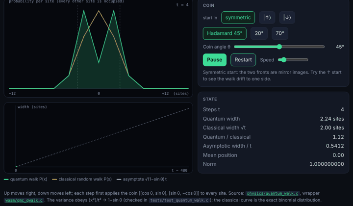
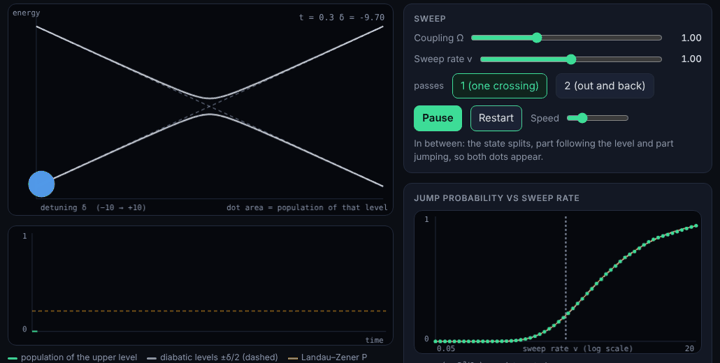
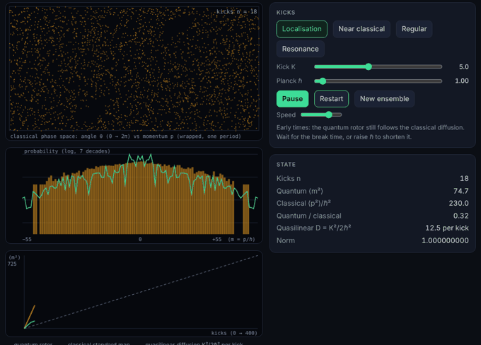
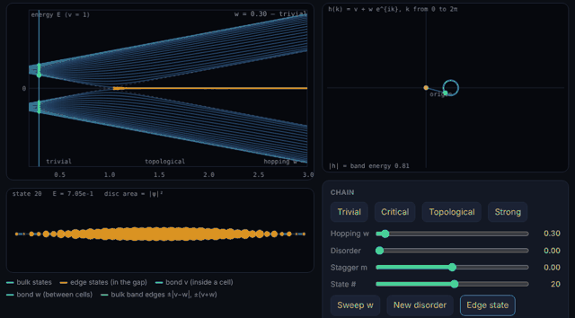
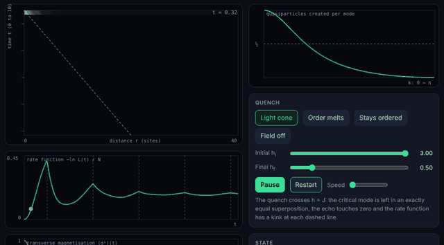

# Showcase: quantum mechanics that runs in your browser

11 interactive demos, all computed live by the same C library you can read
in this repository. There is no JavaScript physics: each page loads a
WebAssembly module compiled from the QMC sources and JavaScript only draws
what the C code returns.

| Demo                                              | Physics                                               | Library routine                     | Size  |
| ------------------------------------------------- | ----------------------------------------------------- | ----------------------------------- | ----- |
| [Double slit](playground/index.html)              | 2D wave interference                                  | `soft_evolve_2d`                    | 21 KB |
| [Hofstadter butterfly](playground/butterfly.html) | Electrons in a magnetic field on a lattice            | Hofstadter spectrum + Chern numbers | 51 KB |
| [Klein paradox](playground/dirac.html)            | Relativistic electron hitting a barrier               | `dirac_evolve_1d`                   | 24 KB |
| [Hydrogen orbitals](playground/orbitals.html)     | Atomic orbitals in 3D                                 | `hydrogen_orbital_sample`           | 34 KB |
| [Bloch sphere](playground/bloch.html)             | A driven, decaying qubit                              | `bloch_evolve`                      | 19 KB |
| [Anderson localisation](playground/anderson.html) | A particle that stops spreading in a disordered chain | `anderson_evolve`                   | 8 KB  |
| [Quantum walk](playground/quantum_walk.html)      | Linear spreading instead of √t                        | `qwalk_step`                        | 16 KB |
| [Landau-Zener](playground/landau_zener.html)      | A qubit swept through an avoided crossing             | `lz_sweep`                          | 12 KB |
| [Kicked rotor](playground/kicked_rotor.html)      | Quantum chaos and dynamical localisation              | `krotor_step`                       | 19 KB |
| [SSH chain](playground/ssh_chain.html)            | Topological edge states in one dimension              | `ssh_chain_solve`                   | 25 KB |
| [Ising quench](playground/ising_quench.html)      | Light cone and dynamical phase transitions            | `tfim_quench_zz`                    | 23 KB |

## The double slit, solved rather than drawn

Fire a wavepacket at a wall with two openings and an interference pattern
builds up on the detector screen, one arrival at a time. This is not a
cartoon of the pattern: every frame is a step of the time-dependent
Schrödinger equation, advanced with the split-operator method. The
potential acts in position space, the kinetic term acts in momentum space,
and a fast Fourier transform moves between the two. You can draw your own
walls, change the slits, or switch to a tunnelling barrier and watch part
of the packet leak through a region it classically cannot enter.

[Open the demo](playground/index.html) ·
[Background: step potentials and tunnelling](physics/tunneling.md)

## Hofstadter's butterfly

Put an electron on a square lattice and thread a magnetic field through it.
When the flux per plaquette is a rational number p/q, the single band
splits into q sub-bands. Plot every allowed energy against the flux and a
self-similar fractal appears: Douglas Hofstadter's butterfly. Each gap in
the spectrum carries an integer, the Chern number, which counts the
quantised Hall conductance when the Fermi level sits in that gap. The
explorer labels every gap, so you can see the topology and not only the
picture.

[Open the demo](playground/butterfly.html)

## Klein paradox and Zitterbewegung

In non-relativistic quantum mechanics a particle meeting a barrier higher
than its energy is mostly reflected and its transmission decays. The Dirac
equation behaves differently: once the step exceeds the energy gap, the
particle can transmit through negative-energy states. This demo evolves a
relativistic wavepacket into a sharp step with an exact split-operator
propagator and compares the transmitted weight with the closed-form
plane-wave result. A second scene shows Zitterbewegung, the rapid
trembling of a free electron that comes from interference between its
positive- and negative-energy components.

[Open the demo](playground/dirac.html) ·
[Background: relativistic QM](physics/relativistic.md)

## Hydrogen orbitals as a rotatable point cloud

Pick any n, l and m and the page draws that orbital as tens of thousands of
points, each one a position where the electron could be found. The radial
distance is sampled from the library's hydrogen radial wavefunction and the
direction from the spherical harmonic, in real or complex form, with colour
marking the sign of the wavefunction. Rotate it, and compare `s`, `p`, `d`
and `f` shapes directly.

[Open the demo](playground/orbitals.html) ·
[Background: the hydrogen atom](physics/hydrogen.md)

## A qubit on the Bloch sphere

A two-level system is a point on a sphere. Drive it and the point rotates
(Rabi oscillations); let it decay and the point spirals inward. The demo
integrates the Lindblad master equation with amplitude damping and
dephasing, and converts the 2×2 density matrix into a Bloch vector at each
step. Detuning, drive strength and both decay rates are adjustable, and the
steady state matches the analytic result for a driven, damped qubit.

[Open the demo](playground/bloch.html)

## Anderson localisation: why disorder stops a wave

On a perfect chain a particle started on one site spreads at a fixed speed,
so the cloud grows in proportion to time. Give every site a random energy
and, in one dimension, it stops: the wavefunction freezes with an
exponential tail, however weak the disorder. This is Anderson localisation,
the reason a disordered wire is an insulator. The demo draws |ψ|² against
time as a waterfall, so the light cone of the clean chain and the frozen
column of the disordered one sit side by side. The clean-chain width matches
the exact result $\sqrt{2} \cdot t \cdot \tau$, and the weak-disorder localisation length is
checked against a transfer-matrix calculation in the test suite.

[Open the demo](playground/anderson.html)

## The quantum walk

Flip a coin, then step left or right. A classical walker ends up within about
√t steps of the start after t steps. A quantum walker uses a quantum coin and
keeps both outcomes in superposition, so its amplitudes interfere: the cloud
spreads in proportion to t, and the probability piles up near the edges of
the light cone instead of the middle. The demo draws both walks together and
lets you change the coin angle, for which the spreading rate has the exact
form $\sqrt{1 − \sin(\theta) \cdot t}$. This is the same mechanism behind
quantum-walk search algorithms.

[Open the demo](playground/quantum_walk.html)

## Landau-Zener: jumping across an avoided crossing

Two energy levels that would cross are pushed apart by a coupling into an
avoided crossing. Sweep the control parameter through it slowly and the
system follows its level; sweep it quickly and it jumps across the gap, with
the probability $\exp(−\pi\Omega^2/2v)$ found independently by Landau, Zener,
Stückelberg and Majorana in 1932. The demo integrates a qubit through the crossing
and overlays the closed form on a scan of the sweep rate, then sweeps out and
back so the two paths interfere: the fringes stay inside the envelope
4P(1−P). This is how qubits are initialised, read out and probed in many
superconducting and spin-qubit experiments.

[Open the demo](playground/landau_zener.html)

## The kicked rotor: where quantum mechanics tames chaos

Kick a rotor with the same impulse once per turn. Classically this is the
Chirikov standard map: for strong kicks the motion is chaotic and the
momentum random-walks without limit, so its mean square grows in proportion
to the number of kicks. The quantum rotor, kicked in exactly the same way,
follows the classical diffusion for a few kicks and then stops. Quantum
interference freezes the spreading, leaving a momentum distribution with
exponential tails: dynamical localisation, the momentum-space cousin of
Anderson localisation, and one of the first signatures of quantum chaos. At
the special value ℏ = 4π the free rotation drops out and the spreading is
ballistic with the exact result ⟨m²⟩ = (nK/ℏ)²/2, which the test suite
checks to 1e-13.

[Open the demo](playground/kicked_rotor.html)

## The SSH chain: a topological insulator you can build in one line

A chain of atoms with alternating strong and weak bonds is the simplest
topological insulator. Start with the strong bond inside each cell and the
chain is an ordinary insulator. Strengthen the bond between cells instead
and the bulk gap closes and reopens, but the chain has changed: the phase
of the bulk Bloch function now winds once around the origin (winding number
1, Zak phase π), and two states appear in the gap, one at each end, with
energy exponentially close to zero. The page diagonalises the finite chain
live, so you can drag the hopping through the transition and watch the pair
peel off the band edge, then switch on random hopping and see that the edge
states do not move: chiral symmetry protects them. Break that symmetry with
a staggered potential and they shift to ±m. The test suite checks the edge
energy, the decay length 1/ln(w/v), the winding number and the Zak phase
against their closed forms.

[Open the demo](playground/ssh_chain.html)

## The Ising quench: a light cone and a return probability that vanishes

Take 256 spins in the ground state of a transverse-field Ising chain and
change the field suddenly. Correlations between distant spins do not
respond at once: they spread outwards at a finite speed, $4\cdot \min(J, h)$,
and the region the news has not reached stays exactly as it was. That is a
light cone, and it appears here as a picture of $\langle \sigma^z_0 \sigma^z_r
\rangle$ against distance and time. If the quench crosses the critical point,
the probability to find the chain back in its initial state passes through
zero at isolated times, and the rate function $−\ln L(t)/N$ has kinks there:
dynamical quantum phase transitions. The solution is exact, with no truncation,
because the chain maps to free fermions: each pair of momenta is a spin that
precesses about the new field, correlations are Pfaffians of the resulting
Fourier sums and the return probability is a product over modes. The test
suite checks the magnetisation, the echo and the correlations against exact
diagonalisation to 1e-13, and the critical times against their closed form.

[Open the demo](playground/ising_quench.html)

## Run it yourself

Everything here builds from source with a single C compiler. See
[Building from Source](setup/building.md), or clone
[the repository on GitHub](https://github.com/Harshit-Dhanwalkar/QMC) and
read the `wasm/` directory to see how a physics routine becomes a browser
demo.
