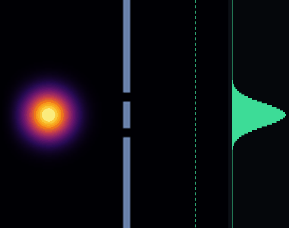
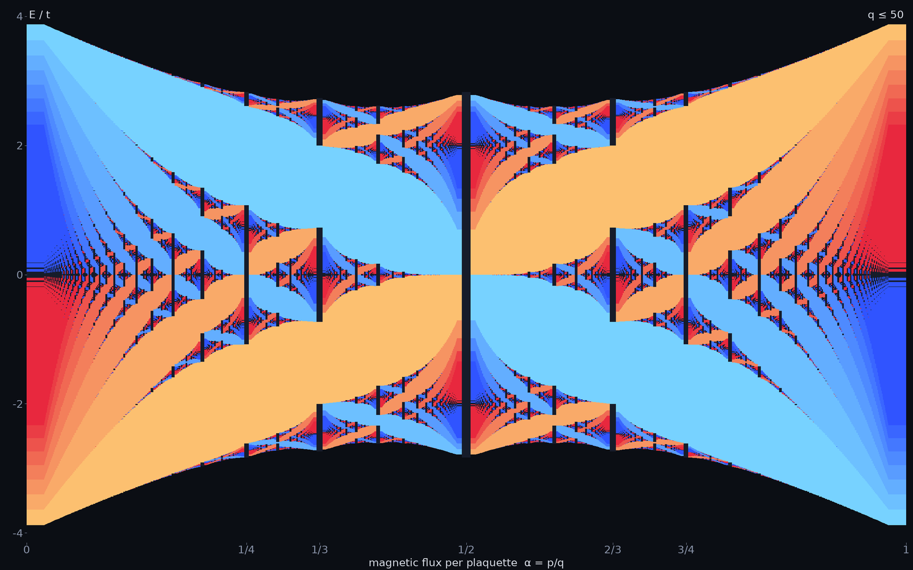
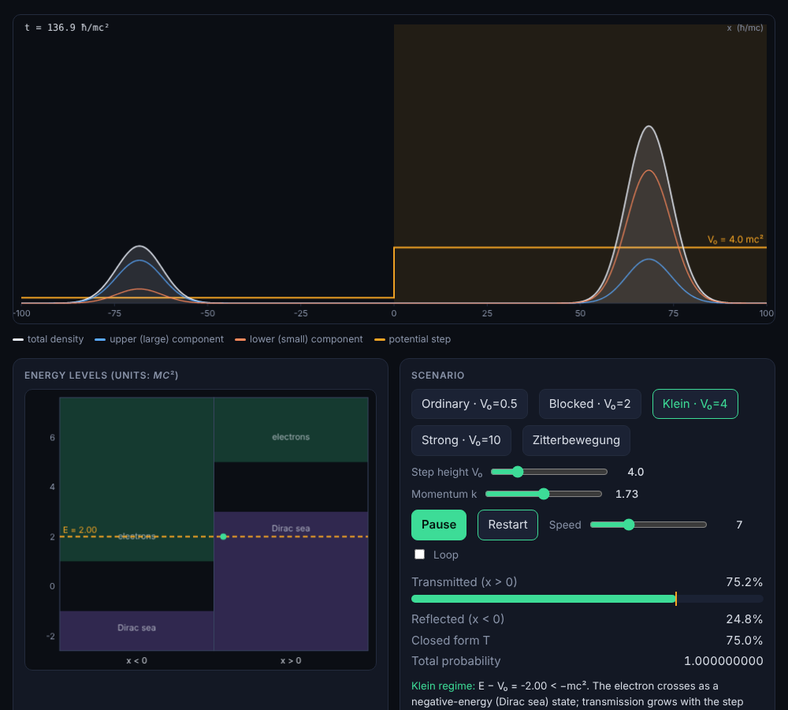
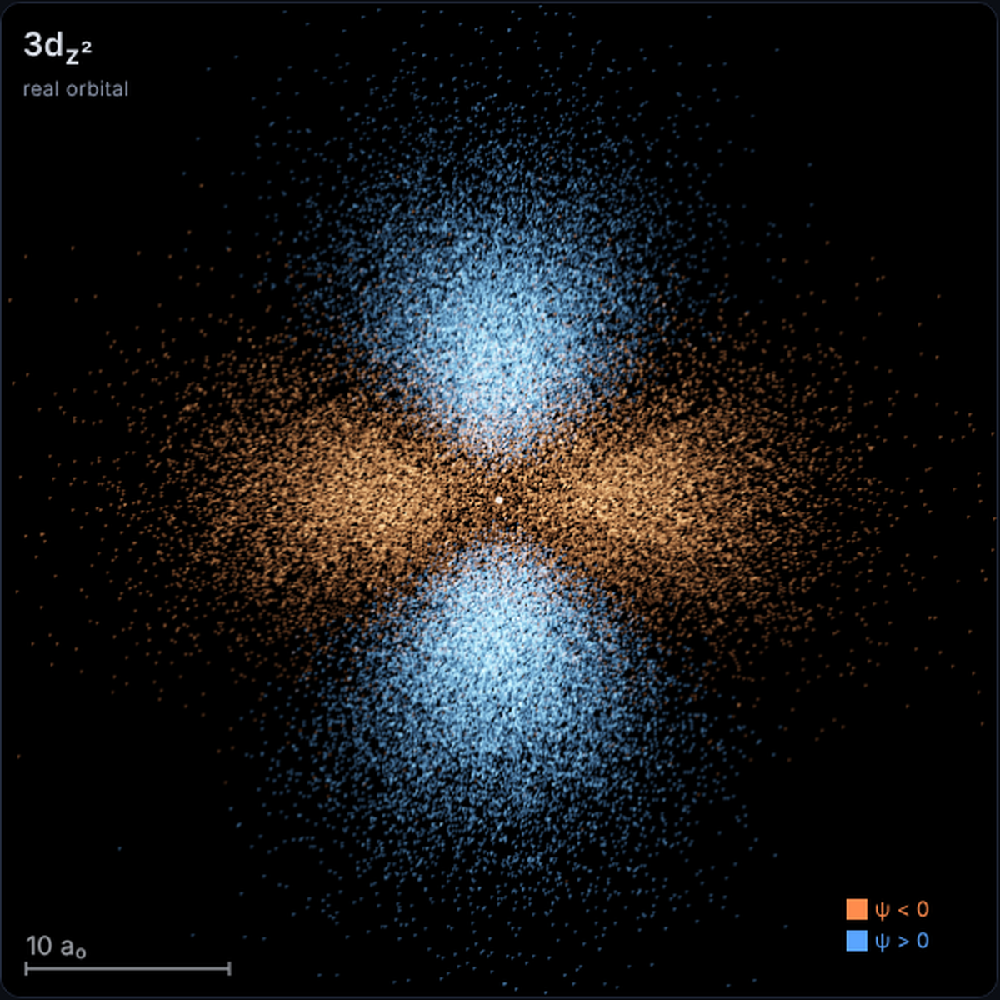
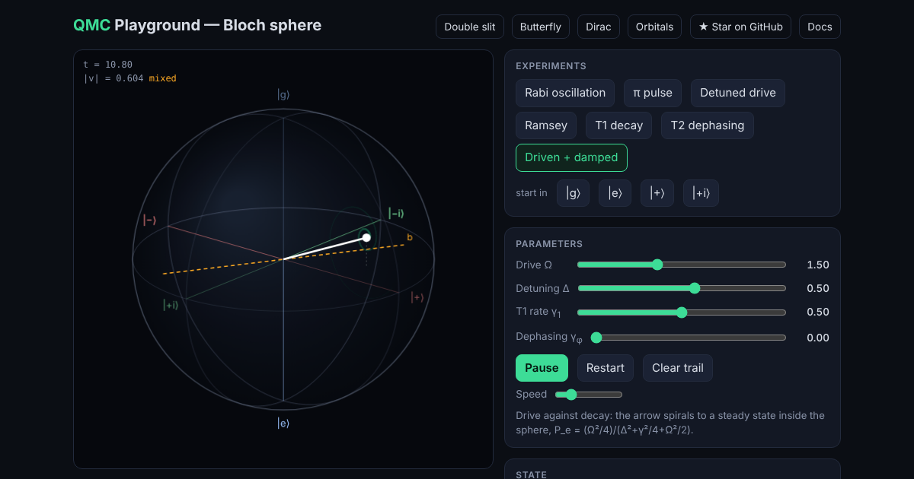
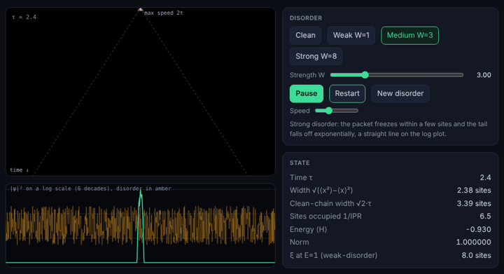

# Showcase: quantum mechanics that runs in your browser

Six interactive demos, all computed live by the same C library you can
read in this repository. There is no JavaScript physics: each page loads a
WebAssembly module (19 to 51 KB) compiled from the QMC sources, and
JavaScript only draws what the C code returns. Every module is checked
against closed-form results and against a native build of the same code.

| Demo                                              | Physics                                               | Library routine                     | Size  |
| ------------------------------------------------- | ----------------------------------------------------- | ----------------------------------- | ----- |
| [Double slit](playground/index.html)              | 2D wave interference                                  | `soft_evolve_2d`                    | 21 KB |
| [Hofstadter butterfly](playground/butterfly.html) | Electrons in a magnetic field on a lattice            | Hofstadter spectrum + Chern numbers | 51 KB |
| [Klein paradox](playground/dirac.html)            | Relativistic electron hitting a barrier               | `dirac_evolve_1d`                   | 24 KB |
| [Hydrogen orbitals](playground/orbitals.html)     | Atomic orbitals in 3D                                 | `hydrogen_orbital_sample`           | 34 KB |
| [Bloch sphere](playground/bloch.html)             | A driven, decaying qubit                              | `bloch_evolve`                      | 19 KB |
| [Anderson localisation](playground/anderson.html) | A particle that stops spreading in a disordered chain | `anderson_evolve`                   | 8 KB  |

## The double slit, solved rather than drawn

Fire a wavepacket at a wall with two openings and an interference pattern
builds up on the detector screen, one arrival at a time. This is not a
cartoon of the pattern: every frame is a step of the time-dependent
Schrödinger equation, advanced with the split-operator method. The
potential acts in position space, the kinetic term acts in momentum space,
and a fast Fourier transform moves between the two. You can draw your own
walls, change the slits, or switch to a tunnelling barrier and watch part
of the packet leak through a region it classically cannot enter.

[Open the demo](playground/index.html) ·
[Background: step potentials and tunnelling](physics/tunneling.md)

## Hofstadter's butterfly

Put an electron on a square lattice and thread a magnetic field through it.
When the flux per plaquette is a rational number p/q, the single band
splits into q sub-bands. Plot every allowed energy against the flux and a
self-similar fractal appears: Douglas Hofstadter's butterfly. Each gap in
the spectrum carries an integer, the Chern number, which counts the
quantised Hall conductance when the Fermi level sits in that gap. The
explorer labels every gap, so you can see the topology and not only the
picture.

[Open the demo](playground/butterfly.html)

## Klein paradox and Zitterbewegung

In non-relativistic quantum mechanics a particle meeting a barrier higher
than its energy is mostly reflected and its transmission decays. The Dirac
equation behaves differently: once the step exceeds the energy gap, the
particle can transmit through negative-energy states. This demo evolves a
relativistic wavepacket into a sharp step with an exact split-operator
propagator and compares the transmitted weight with the closed-form
plane-wave result. A second scene shows Zitterbewegung, the rapid
trembling of a free electron that comes from interference between its
positive- and negative-energy components.

[Open the demo](playground/dirac.html) ·
[Background: relativistic QM](physics/relativistic.md)

## Hydrogen orbitals as a rotatable point cloud

Pick any n, l and m and the page draws that orbital as tens of thousands of
points, each one a position where the electron could be found. The radial
distance is sampled from the library's hydrogen radial wavefunction and the
direction from the spherical harmonic, in real or complex form, with colour
marking the sign of the wavefunction. Rotate it, and compare s, p, d and f
shapes directly.

[Open the demo](playground/orbitals.html) ·
[Background: the hydrogen atom](physics/hydrogen.md)

## A qubit on the Bloch sphere

A two-level system is a point on a sphere. Drive it and the point rotates
(Rabi oscillations); let it decay and the point spirals inward. The demo
integrates the Lindblad master equation with amplitude damping and
dephasing, and converts the 2×2 density matrix into a Bloch vector at each
step. Detuning, drive strength and both decay rates are adjustable, and the
steady state matches the analytic result for a driven, damped qubit.

[Open the demo](playground/bloch.html)

## Anderson localisation: why disorder stops a wave

On a perfect chain a particle started on one site spreads at a fixed speed,
so the cloud grows in proportion to time. Give every site a random energy
and, in one dimension, it stops: the wavefunction freezes with an
exponential tail, however weak the disorder. This is Anderson localisation,
the reason a disordered wire is an insulator. The demo draws |ψ|² against
time as a waterfall, so the light cone of the clean chain and the frozen
column of the disordered one sit side by side. The clean-chain width matches
the exact result √2·t·τ, and the weak-disorder localisation length is
checked against a transfer-matrix calculation in the test suite.

[Open the demo](playground/anderson.html)

## Run it yourself

Everything here builds from source with a single C compiler. See
[Building from Source](setup/building.md), or clone
[the repository on GitHub](https://github.com/Harshit-Dhanwalkar/QMC) and
read the `wasm/` directory to see how a physics routine becomes a browser
demo.
